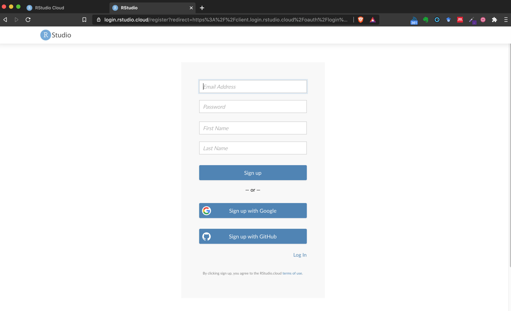
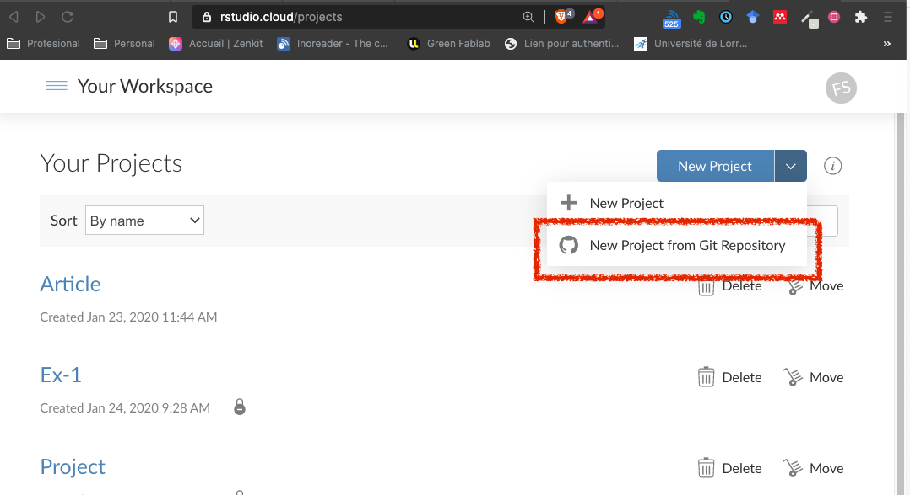
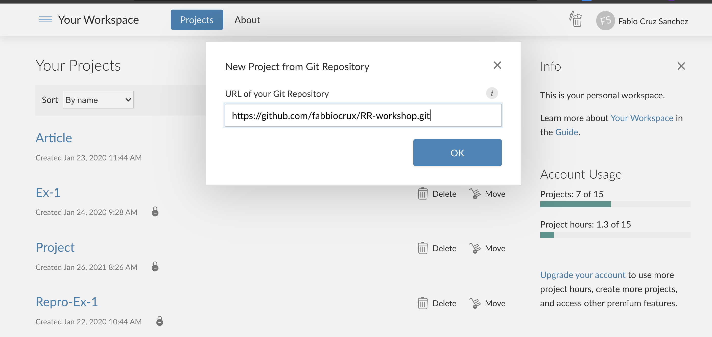
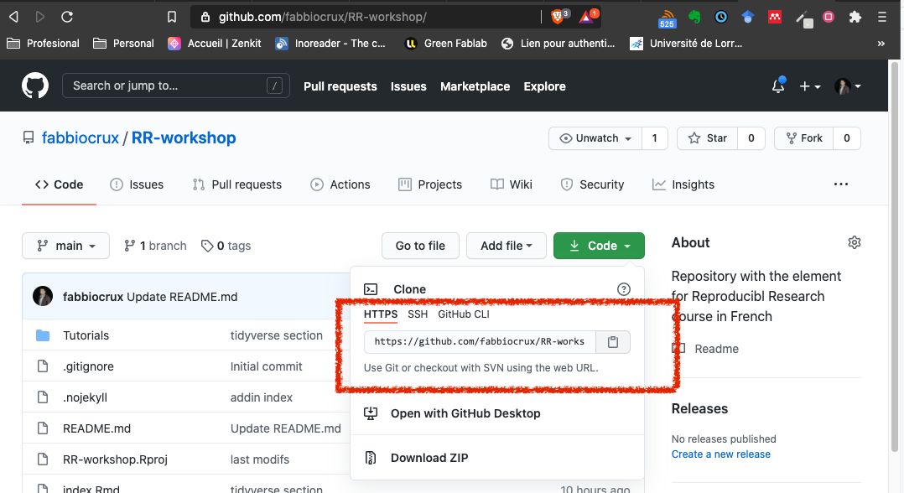

# (PART\*) Software {-}

# Recommended setup {-}

1. Sign up for free version: https://rstudio.cloud/

2. Use you UL account!

3. Voila!, C'est bon


```{r, include=TRUE, fig.align='center', cache=TRUE, out.width='90%'}

```

.infobox.important[
**RStudio Cloud is a webpage**, so no installation is required. 

However, as you have notice, there is some restrictions in the quantity of project and the virtual machine assigned to you.  It's the best option to get start!
]

1. Connecting  Github repo with Rstudio using the link: [https://github.com/fabbiocrux/RR-workshop.git](https://github.com/fabbiocrux/RR-workshop.git)

```{r, include=TRUE, fig.align='center', cache=TRUE, out.width='70%'}

```


```{r, include=TRUE, fig.align='center', cache=TRUE, out.width='70%'}

```


```{r, include=TRUE, fig.align='center', cache=TRUE, out.width='70%'}

```


## Installation in local machine (Only if Rstudio Cloud don't work) {-}

### Install R {-}

1. Go to R-Project https://www.r-project.org/ and click on [download R](http://cran.r-project.org/mirrors.html).
2. Go to France, and select a Mirror (Univ-lyon works normally well!)
3. Download according your machine and install

### Rstudio {-}

1. You can install R Studio on your own machine from: https://www.rstudio.com/products/rstudio/download/#download

RStudio is a free and open-source integrated development environment for R 

So, two options are proposed. **Please, do these steps before the day of the workshop**.
If questions or problems, let us know as soon as possible

Before the day of the course, we advise you to get functional access to these software / and platforms. 


