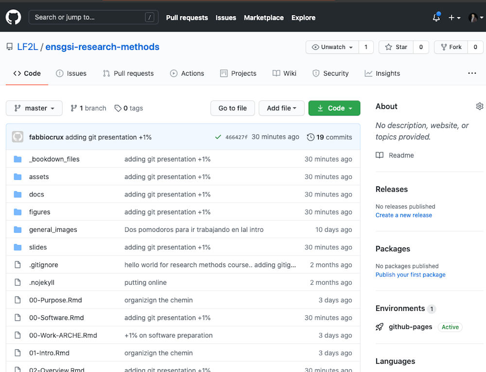

```{r , echo=FALSE}
knitr::opts_chunk$set(echo = FALSE, include = FALSE)
xaringanExtra::use_share_again()
```

# Learning outcomes

By the end of this practical you should be able to:

- Explain the use of and differences between Git and GitHub
- Create reproducible and open file


---
class: middle, left
background-image: url("http://phdcomics.com/comics/archive/phd052810s.gif")
background-position: 105% 50%
background-size: 60%


# The problem

.pull-left[
- I hope we all know this issue when the deadline is arriving...
]

---
class: middle, left
background-image: url('http://phdcomics.com/comics/archive/phd101212s.gif')
background-position: 90% 50%
background-size: 40%

.pull-left[
Those are the days where you say yourself that <br>
it won't happen again.. 
]

.pull-down[
Nevertheless, it arrives that you do it again and again..
]


---

## Methods for tracking versions

- No tracking
  - Good luck!

-  Have a sytematize technique in your mind
  - Good luck!
  
- .content-box-green[Formal version control]
  - Easy to study changes back in time
  - Easy to jump back and test

---

# Formal version control

- It is not strictly necessary for *reproducibility*, but it can be hugely useful for *sanity* (and for managing collaborative projects, and for long-term efficiency).

The promise with formal version control:
.pull-left[
- Can make it easier to explore the history of changes.
- Enables you to go back to an earlier state to find the source of a bug
- Allows you to try things out without worrying about breaking the things that work.
- Can make it easier to incorporate changes from collaborators, even if you’re all making simultaneous changes to the same set of files.
]

.pull-right[
```{r, include=TRUE, fig.align='center', cache=TRUE}
knitr::include_graphics("https://git-scm.com/images/logo@2x.png")
```

More details: 

https://git-scm.com/book/en/v2/Getting-Started-About-Version-Control
]

---

## Example of Repository

```{r, include=TRUE, fig.align='center', cache=TRUE, out.width='80%'}

```

---

## Example of Repository History

```{r, include=TRUE, fig.align='center', cache=TRUE, out.width='80%'}

```

---

## Example of commits
```{r, include=TRUE, fig.align='center', cache=TRUE, out.width='80%'}

```
---

# Using Git

.pull-left[
**Git is a version control system**. 

- Its original purpose was to help groups of developers work collaboratively on big software projects. 

- Git manages the evolution of a set of files – called a **repository** – in a sane, highly structured way. 

]
.pull-right[

```{r, include=TRUE, fig.align='center'}
knitr::include_graphics("https://git-scm.com/images/logo@2x.png")
```

]

.infobox.tip[
If you have no idea what I’m talking about, think of it as the **“Track Changes”** features from Microsoft Word on steroids
]


---
# Why use Git

- It's fast.
- You don't need acces to a server.
- Amazingly good at merging simultaneous changes.
- Open science is using it.

---

class: middle 

## Attention

.infobox.caution[

Git normaly use command line tools (aka `Terminal` commands).
For the purpose of this workshop, we are not going to use this tools directly.

However, we suggest that people interested get to know a 

Take a look at: 
- [Git's Official documentation](https://git-scm.com/docs)
- [Happy git with R](https://happygitwithr.com/git-intro.html)
] 

---

## Attention

For example
When you have a repository, and you change some files:

- See what you’ve changed with `git add`
- 
    


---

# What is Github?

.pull-left[

- Github is like *facebook for programmers*. Everyone’s on there. 
- Interface for exploring git repositories.
- You can look at what they’re working on and easily per use their code and make suggestions or changes.

- **Real** open source.
  - immediate, easy access to the code
  
- Free 2-year 'micro' account for Students
  - [education.github.com](https://education.github.com/)  
]

.pull-right[
```{r, include=TRUE, fig.align='center', cache=TRUE, out.width='30%'}
knitr::include_graphics("https://github.githubassets.com/images/modules/logos_page/Octocat.png")
```
]

.content-box-green[
If you have no idea what I’m talking about, think of it as **DropBox** but much, much better !. 
]

---

# Why is Github?

- **It takes care of the server aspects of git**.
- **Graphical user interface for git**.
  - Explore the contente and its hystory.
  - Tracking issues
- **Facilitates**:
  - Learning from others
  - Seeing what people are up to
  
- **Lowers the barrier to collaboration**
  - *"There is an error in your document" Vs "Hey!, here is a correction for you document"*

---

# Is it going to hurt use Github?

Yes, 

-- 
Version control is a tough sell.
--

It requires a big initial investment in time and effort, initial experiences are often rocky, and the advantages are mostly long-term.

**but**

--
.content-box-green[
We'll start baby steps by putting a single project under version control. 

] 

---

class:  middle center

.assignment.infobox[
.Large[Hands on the workshop!.]
The main goal is to use
]

---

# Setup 1 (Reccomended)

## Github account

1. Go to the github plateform: https://github.com/ 

2. Create an account using your UL email.

3. Recommendations:
  - This site will present the projects that eventually you will work. Make it professional!. You will able to valorise in your cv. 
  - Put your photo, a description of who you are.
  - Use a profesiona nickname.

---

## Github account

Once you have an account:

- Create a new repository (call it  like - ‘`Example`’ or something similar), making sure it is public and you check the box that says ‘initialise new repository with a README’ 

— Click ‘create repository’ at the bottom

```{r echo=FALSE, out.width = "90%", fig.align='center', cache=TRUE}
knitr::include_graphics('img/Github-00.jpg')
```


---

## Github account

Checkout this video if it is not clear!

.center[
<iframe width=80% height="450" src="https://www.youtube.com/embed/iv8rSLsi1xo" frameborder="0" margin="20px" allow="accelerometer; autoplay; clipboard-write; encrypted-media; gyroscope; picture-in-picture" allowfullscreen></iframe>
]


---


---

# Useful material to look

- [Happy git and Github for the useR](https://happygitwithr.com/big-picture.html)
- [Material from Karl Broman](https://kbroman.org/github_tutorial/pages/why.html)


