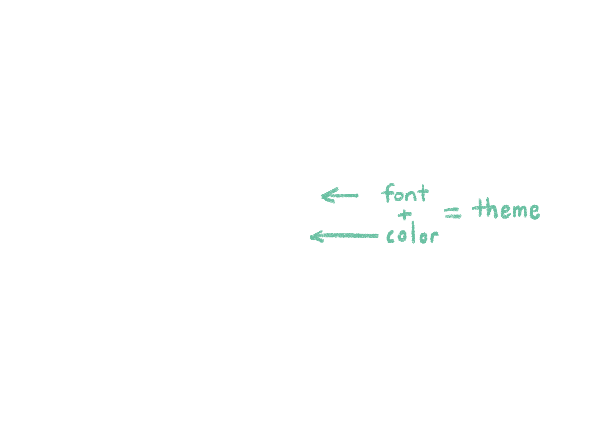
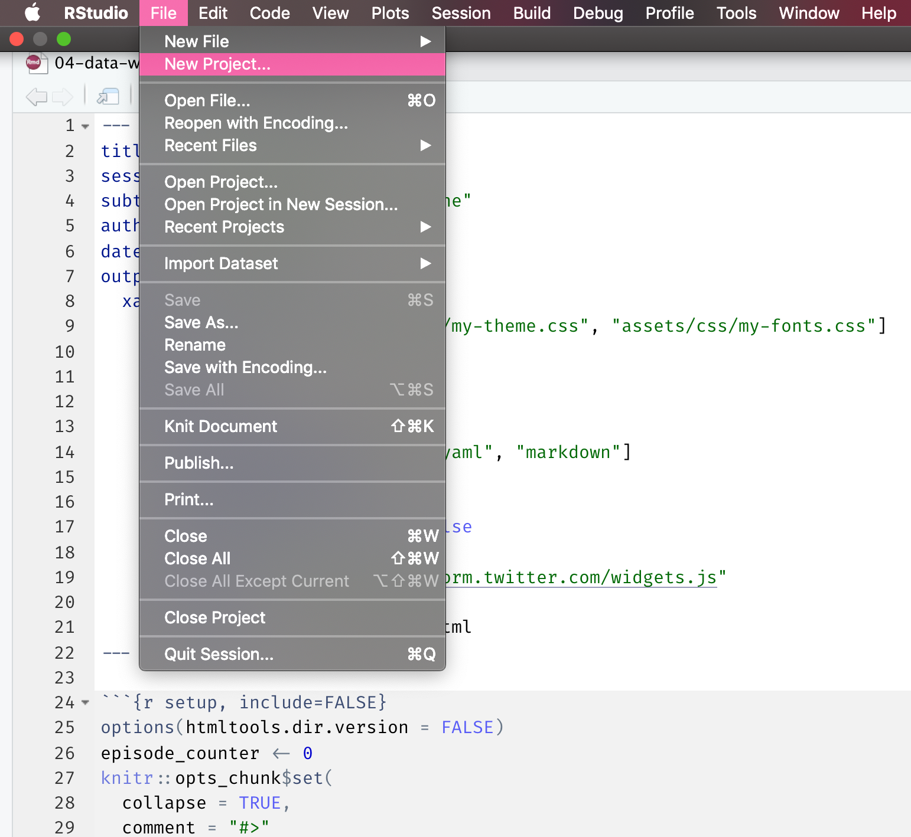
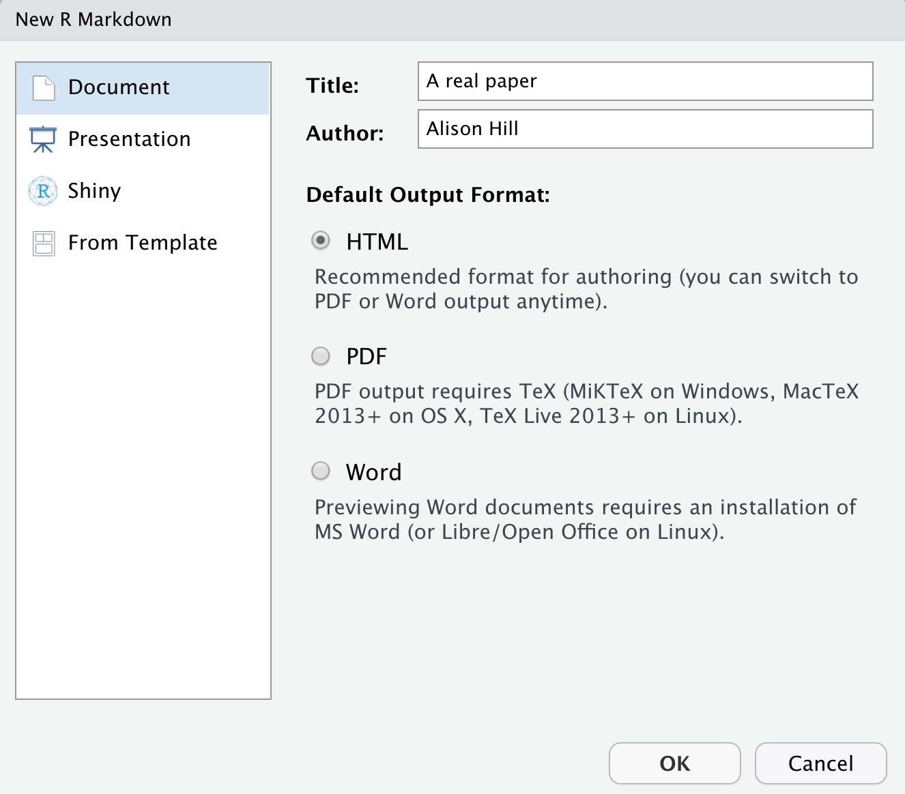
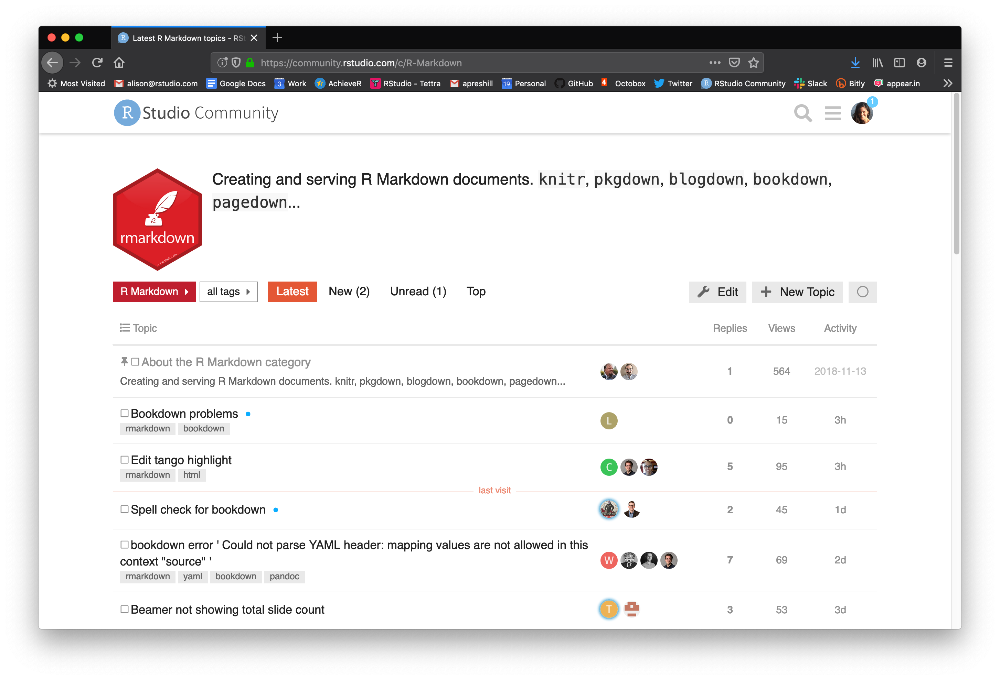

```{r setup, include=FALSE}
options(htmltools.dir.version = FALSE)
episode_counter <- 0
knitr::opts_chunk$set(
  collapse = TRUE,   
  comment = "#>"
)
```

```{r packages, include=FALSE}
library(countdown)
library(ymlthis)
library(tidyverse)
library(arsenal)
library(janitor)
library(scico)
library(cowplot)
ggplot2::theme_set(ggplot2::theme_minimal())
library(babynames)
```

```{r load-data, include=FALSE}
#mockdata <- read_csv(here::here("mockpaper/data/mockboston.csv")) 
```


class: title-slide, right, top


# `r rmarkdown::metadata$title`

## `r rmarkdown::metadata$author` &#183; UL

#### <https://github.com/LF2L/ensgsi-research-methods>


---
class: inverse, middle, center

# What is R Markdown?

---

# What is R Markdown?

--

1. An authoring framework for data science.

--

1. A document format (`.Rmd`).

--

1. An R package named `rmarkdown`.

--

1. A file format for making dynamic documents with R. 

--

1. A tool for integrating prose, code, and results.

--

1. A computational document.

--

1. Wizardry.

---


# What is R Markdown?

1. ["An authoring framework for data science."](https://rmarkdown.rstudio.com/lesson-1.html) (`r emo::ji("heavy_check_mark")`)

1. [A document format (`.Rmd`).](https://bookdown.org/yihui/rmarkdown/) (`r emo::ji("heavy_check_mark")`)

1. [An R package named `rmarkdown`.](https://rmarkdown.rstudio.com/docs/) (`r emo::ji("heavy_check_mark")`)

1. ["A file format for making dynamic documents with R."](https://rmarkdown.rstudio.com/articles_intro.html) (`r emo::ji("heavy_check_mark")`)

1. ["A tool for integrating text, code, and results."](https://r4ds.had.co.nz/communicate-intro.html) (`r emo::ji("heavy_check_mark")`)

1. ["A computational document."](http://radar.oreilly.com/2011/07/wolframs-computational-documen.html) (`r emo::ji("heavy_check_mark")`)

1. Wizardry. (`r emo::ji("wizard")`)


---
background-image: url(images/rmarkdown_wizards.png)
background-size: contain

.footnote[Art by [Allison Horst](https://twitter.com/allison_horst?lang=en)]

---
class: inverse, middle, center

# Why R Markdown?

---
class: center
background-image: url(https://media.giphy.com/media/11fDMHAzihB8D6/source.gif)

# Reproducibility crisis? 

???

We are not here today to solve science or medicine's reproducibility crisis.

What I do think R Markdown can help you with today when you leave here is to tackle two other crises: one I think of as the confidence crisis...

---
class: center
background-image: url(https://media.giphy.com/media/OPZZ6KWJOZ3AA/source.gif)

# Confidence crisis


---
class: center
background-image: url(images/remote-crisis.jpg)
background-size: cover

# `r emo::ji("rotating_light")` Current crisis `r emo::ji("rotating_light")`

---
class: middle, center

# Change your mental model

.pull-left[

### Source &harr; output

```{r echo=FALSE, out.width="50%"}
knitr::include_graphics("images/word.png")
```

]

.pull-right[

### Source &rarr; output

```{r echo=FALSE, out.width="50%"}

```

]

---
class: middle, center

# Change your mental model

.pull-left[

### Source &harr; output

```{r echo=FALSE, out.width="50%"}
knitr::include_graphics("images/haba-elise.jpg")
```

]

.pull-right[

### Source &rarr; output

```{r echo=FALSE, out.width="50%"}
knitr::include_graphics("images/doll.png")
```

]

---
background-image: url(images/welliewishers/Slide1.png)
background-size: cover
class: top, center

.footnote[https://www.americangirl.com/shop/c/welliewishers]

---
background-image: url(images/welliewishers/Slide2.png)
background-size: cover
class: top, center

.footnote[https://www.americangirl.com/shop/c/welliewishers]

---
class: middle, inverse, center

# Same ~~doll~~ source

--

# Different ~~outfits~~ outputs

---
class: middle, center

# `html_document`

```{r echo=FALSE, out.width="40%"}
knitr::include_graphics("images/doll.png")
```


---
class: middle, center

# What is inside?


---
name: card0
background-image: url(images/card0.png)
background-size: contain

.footnote[https://www.dear-data.com/]

---
name: card1
background-image: url(images/card1.png)
background-size: contain

.footnote[https://www.dear-data.com/]


---

# metadata: YAML

.pull-left[

_"YAML Ain't Markup Language"_


```yaml
---
key: value
---
```

]

.pull-right[

```{r echo=FALSE, out.width="75%", fig.align='center'}
knitr::include_graphics("images/orchestra.jpg")
```

]

---
class: middle, center

# Output options

---

# Save output options in your YAML

.pull-left[

```{r echo = FALSE}
yml_empty() %>% 
 yml_author("Your name here") %>% 
  yml_title("Your title here") %>% 
  yml_output(html_document()) %>% 
  asis_yaml_output()
```

```{r echo = FALSE}
yml_empty() %>% 
  yml_author("Your name here") %>% 
  yml_title("Your title here") %>% 
  yml_output(html_document(toc = TRUE,
                           toc_float = TRUE,
                           theme = "flatly")) %>% 
  asis_yaml_output()
```


]

.pull-right[

```{r echo=FALSE, out.width="75%", fig.align='center'}
knitr::include_graphics("images/orchestra.jpg")
```

]

---
background-image: url(images/Single-rmd.png)
background-size: contain

---
background-image: url(images/Single-rmd1.png)
background-size: contain

---
background-image: url(images/Single-rmd2.png)
background-size: contain

---
background-image: url(images/Single-rmd3.png)
background-size: contain

---

---
class: middle center
background-image: url(images/Single-knit1.png)
background-size: contain

???

Here is what we knit. 

--



???

Using the `THEME:` key in our YAML, we changed our font and colors.

--


???

And we have this nice table of contents floating off to the side...

---
class: middle

# Check-in

.pull-left[
How do you use only the **default** output options?

(a)
```yaml
---
output: html_document()
---
```
(b)
```yaml
---
output: html_document
---
```

]

--

.pull-right[
How do you add an output **option** to a format in your YAML?

(a)
```yaml
---
output: 
  html_document: 
    toc: true
---
```

(b)
```yaml
---
output: 
  html_document(toc=true)
---
```

]

---
class: middle, center

# Output formats


---
class: middle, center


```{r echo=FALSE, out.width="40%", fig.link="https://rmarkdown.rstudio.com/docs/reference/index.html#section-output-formats"}
knitr::include_graphics("images/rmdbase-formats.png")
```

https://rmarkdown.rstudio.com/docs/reference/index.html#section-output-formats

---

# `r emo::ji("yarn")` Knit

.pull-left[
```{r echo=FALSE, out.width="60%", fig.align="center"}
knitr::include_graphics("images/knit-dropdown.png")
```

]

.pull-right[

```{r echo=FALSE}
yml_empty() %>% 
  yml_author("Your name here") %>% 
  yml_title("Your title here") %>% 
  yml_output(html_document(toc = TRUE, toc_float = TRUE, theme = "flatly"), 
             word_document(), 
             pdf_document()
             )  %>% 
  asis_yaml_output()
```
]

???

This is a great way to "control" your knit button!

Notice that when you knit, it respects those output options in your YAML.

This way you "save" your output options


---
class: middle

# Check-in

.pull-left[
How do you add another output **format** to your YAML?

(a)
```yaml
---
output: 
  html_document: default
  word_document: default
---
```
(b)
```
---
output: 
  html_document()
  word_document()
---
```

]

--


.pull-right[
How do you now add output **options** to your YAML?

(a)
```yaml
---
output: 
  html_document: 
    toc: true
  word_document: default
---
```
(b)
```
---
output: 
  html_document(toc=true)
  word_document(default)
---
```

]

---
class: middle, center
# Built-in output formats


```{r echo=FALSE, out.width="32%"}
knitr::include_graphics("https://raw.githubusercontent.com/rstudio/hex-stickers/master/PNG/rmarkdown.png")
```

---
class: middle, center

```{r echo=FALSE,out.width="50%"}
knitr::include_graphics("images/outputs.png")
```

???

Built in formats (in the `rmarkdown` package)

versus

extensions (different packages that extend output formats available to you)

---
class: middle, center

# Extension output formats


```{r echo=FALSE, out.width="32%"}
knitr::include_graphics("https://raw.githubusercontent.com/rstudio/hex-stickers/master/PNG/flexdashboard.png")

knitr::include_graphics("https://raw.githubusercontent.com/rstudio/hex-stickers/master/PNG/bookdown.png")

knitr::include_graphics("https://raw.githubusercontent.com/rstudio/hex-stickers/master/PNG/xaringan.png")
```

---
class: middle, left

```{r echo=FALSE}
knitr::include_url("https://rstudio.github.io/distill/")
```


---
class: middle

.center[
# Use an extension package
]


.pull-left[
```{r echo = FALSE}
yml_empty() %>% 
  yml_author("Your name here") %>% 
  yml_title("Your title here") %>% 
  yml_output(distill::distill_article(),
             bookdown::html_document2()) %>% 
  asis_yaml_output()
```
]

.pull-right[
```{r echo = FALSE}
yml_empty() %>% 
  yml_author("Your name here") %>% 
  yml_title("Your title here") %>% 
  yml_output(distill::distill_article(toc = TRUE),
             bookdown::html_document2(toc = TRUE, theme = "flatly", toc_float = TRUE)) %>% 
  asis_yaml_output()
```
]


---
template: card0

---
template: card1

---
name: card2
background-image: url(images/card2.png)
background-size: contain

.footnote[https://www.dear-data.com/]

---
class: center, middle

# Do this! `r emo::ji("point_down")`

# https://commonmark.org/help/tutorial/

---

# <center>Headers</center>

--

.pull-left[
```markdown
# HEADER 1

## HEADER 2

### HEADER 3

#### HEADER 4

##### HEADER 5

###### HEADER 6
```
]

--

.pull-right[
# HEADER 1

## HEADER 2

### HEADER 3

#### HEADER 4

##### HEADER 5

###### HEADER 6
]

---


---

# <center>Text</center>

--

.pull-left[
```markdown
Childhood **vaccines**  
are one of the  
_great triumphs_  
of modern medicine. 
```
]

--

.pull-right[

Childhood **vaccines**  
are one of the  
_great triumphs_  
of modern medicine. 

]

---
class: top

# <center>Lists</center>

--

.pull-left[

```markdown
Indeed, parents whose children are  
vaccinated no longer have to worry about  
their child's death or disability from:

- whooping cough, 
- polio, 
- diphtheria, 
- hepatitis, or 
- a host of other infections.

Vaccines are the most cost-effective health  
care interventions there are. We have   
three new, extremely effective vaccines to  
roll out in developing countries:  

1. pneumonia
1. rotavirus
1. meningitis A
```

]

--

.pull-right[

Indeed, parents whose children are  
vaccinated no longer have to worry about  
their child's death or disability from:

- whooping cough, 
- polio, 
- diphtheria, 
- hepatitis, or 
- a host of other infections.

Vaccines are the most cost-effective health  
care interventions there are. We have  
three new, extremely effective vaccines to  
roll out in developing countries:

1. pneumonia
1. rotavirus
1. meningitis A

]

---

# <center>Images</center>

--

.pull-left[
```markdown
Receiving rubella vaccination, Brazil, 2008.

```
]

--

.pull-right[
Receiving rubella vaccination, Brazil, 2008.

]

---

# <center>Links</center>

--

.pull-left[
```markdown
[Photo](https://en.wikipedia.org/wiki/Vaccine)

Receiving rubella vaccination, Brazil, 2008.

```
]

--

.pull-right[
[Photo](https://en.wikipedia.org/wiki/Vaccine)

Receiving rubella vaccination, Brazil, 2008.

]

---
name: 03-formative
class: middle

# Check-in

--

.pull-left[

How do you add headers in Markdown?

`! Header`

`- Header`

`# Header`

`1. Header`

]

--

.pull-right[

What about lists? Bulleted? Numbered?

`! Item 1`

`- Item 1`

`# Item 1`

`1. Item 1`

]

---
template: card0

---
template: card1

---
template: card2

---
name: card3
background-image: url(images/card3.png)
background-size: contain

---
class: middle, center, inverse

# `code` -> plots
---

# Code chunks

.pull-left[

````
```{r}`r ''`
babynames %>% 
  distinct(arm)
```
````

What is the fate of this chunk?

]

--

.pull-right[

```{r}
#mockdata 
babynames %>% 
  distinct(sex)
```

]

---

# Code chunks


.pull-left[

````
```{r}`r ''`
n_sites <- n_distinct(babynames$sex)
```
````

What fate do you predict here?

]

--

.pull-right[

```{r}
n_sites <- n_distinct(babynames$sex)
```

  
]

---

# Code chunks


.pull-left[

````
```{r}`r ''`
n_sites <- n_distinct(babynames$sex)
n_sites
```
````

]

--

.pull-right[

```{r}
n_sites <- n_distinct(babynames$sex)
n_sites
```

  
]


---


# Including plots

.pull-left[
```{r age-hist-print1, fig.show='hide'}
# PLOT: distribution -------------------------------------------------------
ggplot(data = mpg) + 
  geom_boxplot(mapping = aes(x = class, y = hwy)) +
  labs(x = "Class", 
       y = "Count")
  
```

Will this print?

]

--

.pull-right[
```{r ref.label='age-hist-print1', echo=FALSE, fig.retina=3}
```

]

---

# Including plots

.pull-left[
```{r age-hist}
# PLOT: distribution -------------------------------------------------------
age_histogram <- 
  ggplot(data = mpg) + 
  geom_boxplot(mapping = aes(x = class, y = hwy)) +
  labs(x = "Class", 
       y = "Count")
  
```

What about this?

]

--

.pull-right[
```{r ref.label='age-hist', echo=FALSE}
```

]


---

# Including plots

.pull-left[
```{r age-hist-print, fig.show='hide'}
# PLOT: distribution -------------------------------------------------------
age_histogram <- 
  ggplot(data = mpg) + 
  geom_boxplot(mapping = aes(x = class, y = hwy)) +
  labs(x = "Class", 
       y = "Count")
age_histogram
```

]

--

.pull-right[
```{r ref.label='age-hist-print', echo=FALSE, fig.retina=3}
```

]

???


so, how did we get a figure into R Markdown?

Answer: it has to print!

---

# Chunk options for plots

- fig resolution
- fig size
- [fig "device"](https://r4ds.had.co.nz/graphics-for-communication.html#other-important-options)

.footnote[https://yihui.name/knitr/options/#plots]

---

# out.width

.pull-left[

````
```{r out.width="70%"}`r ''`
age_histogram
```
````

```{r ref.label='age-hist-print', echo=FALSE, out.width="70%", fig.retina=3}
```
]

--

.pull-right[

````
```{r out.width="10%"}`r ''`
age_histogram
```
````

```{r ref.label='age-hist-print', echo=FALSE, fig.retina=3, out.width="10%"}

```

See also:

+ `fig.width`
+ `fig.height` 
+ `fig.asp`

https://r4ds.had.co.nz/graphics-for-communication.html#figure-sizing

]


---

# Chunk labels

.pull-left[

````
```{r peek}`r ''`
glimpse(babynames)
```
````

]

.pull-right[

+ Place between curly braces<br>`{r label}`

+ Separated options with commas<br>`{r label, option1=value}`

+ Careful! No duplicate chunk labels

    ````
    ```{r peek}`r ''`
    head(babynames)
    ```
    ````

    ```
    Error in parse_block(g[-1], g[1], params.src) : 
      duplicate label 'peek'
    Calls: <Anonymous> ... process_file -> split_file -> lapply -> FUN -> parse_block
    Execution halted
    ```

]

???

how can we make it easier on ourselves to explore the code in here?

show how to add chunk labels and view in IDE interactively

---
class: top, center
background-image: url(images/plants.jpg)
background-size: 70%
background-color: #fff5ec

# Chunks as crops or houseplants?

.footnote[https://masalmon.eu/2017/08/08/chunkpets/]

---
class: middle, center

# A good chunk label

.pull-left[

### Good

`my-plot`

`myplot`

`myplot1`

`myplot-1`

`MY-PLOT`

]

.pull-right[

### Bad

`my_plot`

`my plot`

everything else!

]

---
class: middle, center

# A good chunk label

Think: kebabs, not snakes


---
background-image: url(images/pour.jpg)
background-position: left
background-size: contain
class: middle, center

.pull-right[

]

---

# fig.cap

````
```{r age-plot, echo=FALSE, fig.cap='Age distributions'}`r ''`
age_histogram
```
````

.center[

```{r age-plot, out.width='25%', echo = FALSE, fig.retina = 3}
age_histogram
```

**Fig. 1:** Age distributions

]


---

# Cross-reference a figure

.pull-left[

See Figure `\@ref(fig:age-plot)`.

````
```{r age-plot, echo=FALSE, fig.cap='Age distributions'}`r ''`
age_histogram
```
````

]

.pull-right[

See Figure [1]().

.center[

```{r ref.label = 'age-plot', out.width='70%', echo = FALSE, fig.retina = 3, fig.cap='Age distributions'}
```

]

]

.footnote[Cross-referencing only works in these output packages: distill, bookdown, blogdown]

---

# Key takeaway

Once you have:

`r emo::ji("heavy_check_mark")` A labeled chunk that produces a plot

`r emo::ji("heavy_check_mark")` A figure caption using `fig.cap`

Then you can have:

### Cross-references!*

.footnote[\* and you are using distill, bookdown, or blogdown output formats]


---

# message / warning


---

# message / warning

.pull-left[

````
```{r message=FALSE, warning=FALSE}`r ''`
library(tidyverse)
```
````

]

.pull-right[

```{r message=FALSE, warning=FALSE}
library(tidyverse)
```

]

---

# Other useful chunk options

.pull-left[

````
```{r}`r ''`
glimpse(babynames)
```
````

]

.pull-right[

```{r}
glimpse(babynames)
```

]

---

# echo

.pull-left[

````
```{r echo=FALSE}`r ''`
glimpse(babynames)
```
````

]

.pull-right[

```{r echo=FALSE}
glimpse(babynames)
```

]

---

# eval

.pull-left[

````
```{r eval=FALSE}`r ''`
glimpse(babynames)
```
````

]

.pull-right[

```{r eval=FALSE}
glimpse(babynames)
```

]

---

# include

.pull-left[

````
```{r include=FALSE}`r ''`
glimpse(babynames)
```
````

]

.pull-right[

```{r include=FALSE}
glimpse(babynames)
```

]

---

# Using chunk options

.pull-left[

````
```{r echo=TRUE, results='hide'}`r ''`
glimpse(babynames)
```
````

]

.pull-right[

```{r echo=TRUE, results='hide'}
glimpse(babynames)
```

]

+ Place between curly braces<br>`{r option=value}`

+ Multiple options separated by commas<br>`{r option1=value, option2=value}`

+ Careful! The `r` part is the **code engine** (other engines possible)

---

# A global `setup` chunk `r emo::ji("earth_africa")`

One chunk to rule them all

.pull-left[

````
```{r setup, include = FALSE}`r ''`
knitr::opts_chunk$set(
  warning = FALSE,
  message = FALSE,
  echo = FALSE,
  fig.path = "figs/"
)
```
````

]

.pull-right[

+ A special chunk label: `setup`

+ Typically the first chunk

+ All following chunks will use these options (i.e., sets global chunk options)

+ **Tip**: set `include=FALSE`

+ You can (and should) use individual chunk options too

]


---

.left-column[
# Default options
]

.right-column[
```{r}
str(knitr::opts_chunk$get())
```

]


---
template: card0

---
template: card1

---
template: card2

---
template: card3

---
background-image: url(images/card4.png)
background-size: contain


---
class: center
background-image: url(images/typewriter.jpg)
background-size: contain
background-color: #f6f6f6

# Markdown tables

---
class: center

# Markdown tables

.pull-left[

```markdown
| Time          | Session | Topic    |
|:--------------|:-------:|---------:|
| _left_        | _center_| _right_  |
| 01:00 - 01:50 | 1       | Anatomy  |
| 01:50 - 02:00 |         | *Break*  |
| 02:00 - 02:45 | 2       | Tables   |
| 02:45 - 03:00 |         | *Break*  |

```
]

--

.pull-right[

| Time          | Session | Topic    |
|:--------------|:-------:|---------:|
| _left_        | _center_| _right_  |
| 01:00 - 01:50 | 1       | Anatomy  |
| 01:50 - 02:00 |         | *Break*  |
| 02:00 - 02:45 | 2       | Tables   |
| 02:45 - 03:00 |         | *Break*  |

]


---

# 1-way frequency `kable()`


.pull-left[

```{r}
knitr::kable( head (babynames))
```

] 

--

.pull-right[

```{r}
knitr::kable( head (babynames))
```

]


---
class: middle, center

# Take-aways

--

`r emo::ji("heavy_check_mark")` **Document your document:** use YAML to set up meaningful metadata

--

`r emo::ji("heavy_check_mark")` **Style your document:** use YAML to add options to your chosen output format

--

`r emo::ji("heavy_check_mark")` **Organize your text:** use markdown headers with `#`

--

`r emo::ji("heavy_check_mark")` **Organize your code:** use `knitr` chunk labels

--

`r emo::ji("heavy_check_mark")` **Style your text:** use markdown **bold**, _italics_, <i class="fas fa-list-ul"></i> bullets, and <i class="fas fa-list-ol"></i> lists

--

`r emo::ji("heavy_check_mark")` **Style your output:** use `knitr` chunk options

--

`r emo::ji("yarn")` early, `r emo::ji("yarn")` often


---
class: top

# How does R Markdown work?

1. `r emo::ji("shrug")`

1. I press knit, a document appears, and I believe that anything happening in between could be actual magic.

1. `knitr` executes the code and converts `.Rmd` to `.md`; **Pandoc** renders the `.md` file to the output format you want.

---
class: top

# How *does* R Markdown work?

1. `r emo::ji("shrug")` (`r emo::ji("heavy_check_mark")`)

1. ["I press knit, a document appears, and I believe that anything happening in between could be actual magic."](https://twitter.com/allison_horst/status/1070323369600442368?s=20) (`r emo::ji("wizard")`)

1. `knitr` executes the code and converts `.Rmd` to `.md`; **Pandoc** renders the `.md` file to the output format you want. (`r emo::ji("heavy_check_mark")`)


---
class: middle, center

```{r echo = FALSE, out.width="25%", fig.align="center"}
knitr::include_graphics("https://raw.githubusercontent.com/rstudio/hex-stickers/master/PNG/rmarkdown.png")
```


> "In a nutshell, R Markdown stands on the shoulders of `knitr` and **Pandoc**.

--

> The former executes the computer code embedded in Markdown, and converts R Markdown to Markdown.

--

> The latter renders Markdown to the output format you want (such as PDF, HTML, Word, and so on)."

--

> &mdash; [R Markdown: The Definitive Guide](https://bookdown.org/yihui/rmarkdown/)


---

# Check-in


Which of the following is **NOT** a part of R Markdown basic anatomy?

1. Metadata

1. Text

1. Data

1. Code

1. Output


---

# Mad libs check-in

```markdown
 ___________ is written at the top between `---` in ________.
    noun                                             syntax
                                                     
  ______ is written in Markdown.
   noun         
  
  ______ is written in R (or other programming language).
   noun   
   
  The ______ package evaluates the code and produces the ______.
       noun                                               noun
```


---

# Mad libs check-in

```markdown
 Metadata is written at the top between `---` in YAML.
   (noun)                                      (syntax)
                                                     
  Text is written in Markdown.
 (noun)         
  
  Code is written in R (or other programming language).
 (noun)   
   
  The knitr package evaluates the code and produces the output.
     (noun)                                             (noun) 
```


---

# Sprints


---
class: center, middle

# R projects

```{r echo=FALSE}
knitr::include_graphics("images/rproj.png")
```


---
class: middle, center

.pull-left[
# <i class="fas fa-mouse-pointer"></i>

_File > New Project..._
```{r, echo = FALSE}

```
]
--

.pull-right[
# <i class="fas fa-mouse-pointer"></i>

Pick one
```{r, echo = FALSE}
knitr::include_graphics("images/rstudio-newproj.png")
```
]

---
class: middle, center

.pull-left[
# <i class="fas fa-mouse-pointer"></i>

_File > New File > R Markdown..._
```{r, echo = FALSE}
knitr::include_graphics("images/rstudio-newfile.png")
```
]
--

.pull-right[
# <i class="fas fa-mouse-pointer"></i>

Fill in, can leave as HTML
```{r, echo = FALSE}

```
]

---
class: middle, center

.pull-left[
# <i class="fas fa-trash-alt"></i>


]

--

.pull-right[
# <i class="fas fa-save"></i>


]


# Extension formats

---
class: middle, center

# Dashboards

```{r echo = FALSE, out.width = "50%", fig.link="https://jenthompson.me/examples/progressdash.html"}
knitr::include_graphics("https://jenthompson.me/images/flexdash_example.png")
```

https://jenthompson.me/examples/progressdash.html

https://jenthompson.me/2018/02/09/flexdashboards-monitoring/

---
class: middle, center

<https://bookdown.org/yihui/bookdown/>

<iframe src="https://bookdown.org/yihui/bookdown/" height="600" width="1200" frameborder="0"></iframe> 

---
class: center, middle


<https://bookdown.org/yihui/blogdown/>

<iframe src="https://academic-demo.netlify.com/" height="600" width="1200" frameborder="0"></iframe> 

---
class: middle, center, inverse

<span class="fa-stack fa-4x">
  <i class="fa fa-circle fa-stack-2x" style="color: #fff;"></i>
  <strong class="fa-stack-1x" style="color:#2f5275;">!</strong>
</span> 


# Cheatsheets!

---
class: middle

.left-column[

# `r emo::ji("pushpin")`

]

.right-column[

_Help > Cheatsheets > RStudio IDE_

```{r echo = FALSE, out.width = "50%", fig.link="https://www.rstudio.com/resources/cheatsheets/#ide"}
knitr::include_graphics("https://d33wubrfki0l68.cloudfront.net/0dc0efccfaf638de8be4ce43e2bab8a91541d3d2/c4fdc/wp-content/uploads/2018/08/rstudio-ide.png")
```
]

.footnote[https://www.rstudio.com/resources/cheatsheets/#ide]

---
class: middle

.left-column[
# `r emo::ji("pushpin")`
]

.right-column[
_Help > Cheatsheets > R Markdown Cheat Sheet_

```{r echo = FALSE, out.width="50%", fig.link="https://www.rstudio.com/resources/cheatsheets/#rmarkdown"}
knitr::include_graphics("https://d33wubrfki0l68.cloudfront.net/65dffd1bdcaa0025006262164d98e8068e8b4387/c3895/wp-content/uploads/2018/08/rmarkdown-2.0.png")
```
]

.footnote[https://www.rstudio.com/resources/cheatsheets/#rmarkdown]

---
class: middle

.left-column[
# `r emo::ji("pushpin")`
]

.right-column[
_Help > Cheatsheets > R Markdown Reference Guide_

```{r echo = FALSE, out.width = "40%", fig.link="https://www.rstudio.com/wp-content/uploads/2015/03/rmarkdown-reference.pdf"}
knitr::include_graphics("https://www.rstudio.com/wp-content/uploads/2015/03/rmarkdown-reference-guide.png")
```

]

.footnote[https://www.rstudio.com/wp-content/uploads/2015/03/rmarkdown-reference.pdf]

---
class: middle, center, inverse

<span class="fa-stack fa-4x">
  <i class="fa fa-circle fa-stack-2x" style="color: #fff;"></i>
  <strong class="fa-stack-1x" style="color:#2f5275;">!</strong>
</span> 


# Book!

---
class: middle

.left-column[
# `r emo::ji("book")`
]

.right-column[

```{r echo = FALSE, out.width = "40%", fig.link="https://bookdown.org/yihui/rmarkdown/"}
knitr::include_graphics("https://bookdown.org/yihui/rmarkdown/images/cover.png")
```
]

.footnote[https://bookdown.org/yihui/rmarkdown/]


---
class: middle, center, inverse

<span class="fa-stack fa-4x">
  <i class="fa fa-circle fa-stack-2x" style="color: #fff;"></i>
  <strong class="fa-stack-1x" style="color:#2f5275;">!</strong>
</span> 


# Websites!

---
class: middle

.left-column[
# `r emo::ji("link")`
]

.right-column[

```{r echo = FALSE, out.width = "80%", fig.link="https://rmarkdown.rstudio.com/"}
knitr::include_graphics("images/rmarkdown-site.png")
```
]

.footnote[https://rmarkdown.rstudio.com/]

---
class: middle

.left-column[
# `r emo::ji("link")`
]

.right-column[

```{r echo = FALSE, out.width = "80%", fig.link="https://rmarkdown.rstudio.com/docs/"}
knitr::include_graphics("images/rmarkdowndocs-site.png")
```
]

.footnote[https://rmarkdown.rstudio.com/docs/]

---
class: middle

.left-column[
# `r emo::ji("dart")`
]

.right-column[

```{r echo = FALSE, out.width = "80%", fig.link="https://community.rstudio.com/c/R-Markdown"}

```
]

.footnote[https://community.rstudio.com/c/R-Markdown]

---
class: middle

.left-column[
# `r emo::ji("robot")`
]

.right-column[

```{r echo = FALSE, out.width = "80%", fig.link="https://rmarkdown.rstudio.com/lesson-6.html"}
knitr::include_graphics("https://raw.githubusercontent.com/rstudio/rmarkdown/gh-pages/lesson-images/params-1-hawaii.png")
```
]

.footnote[https://bookdown.org/yihui/rmarkdown/parameterized-reports.html,<br>
https://rmarkdown.rstudio.com/lesson-6.html]


---
class: inverse, middle, center

# Thank you!
