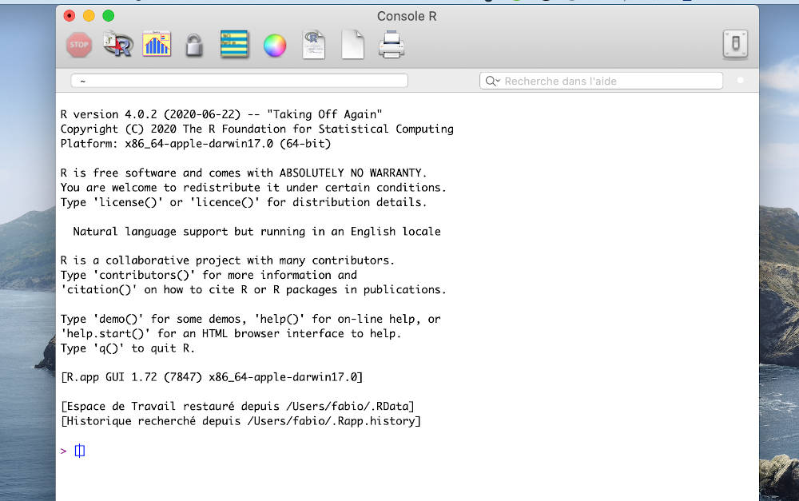
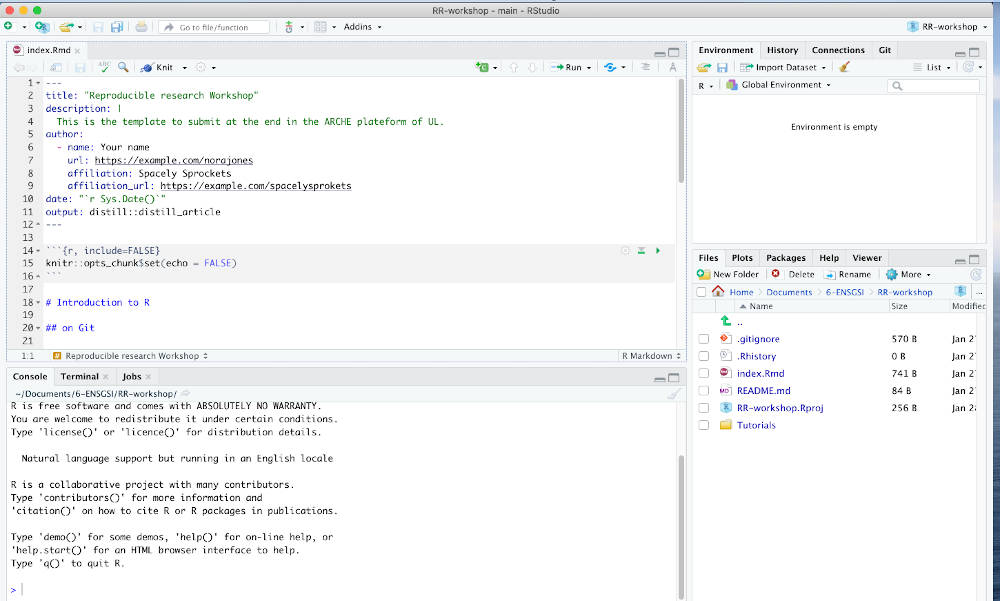
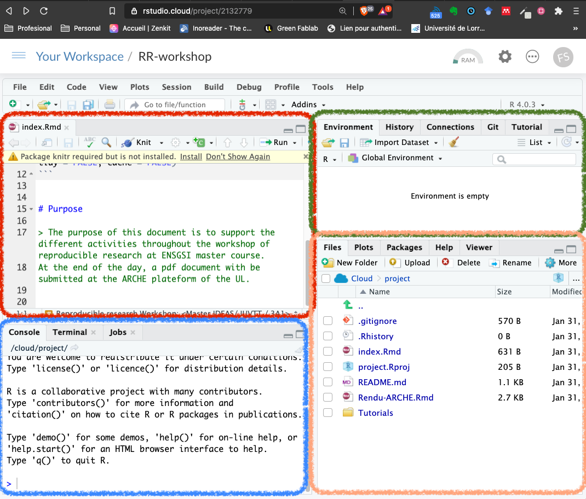
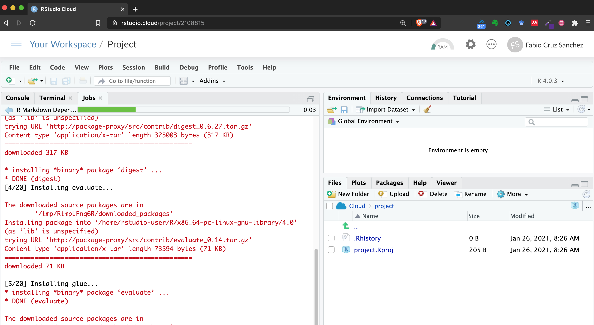
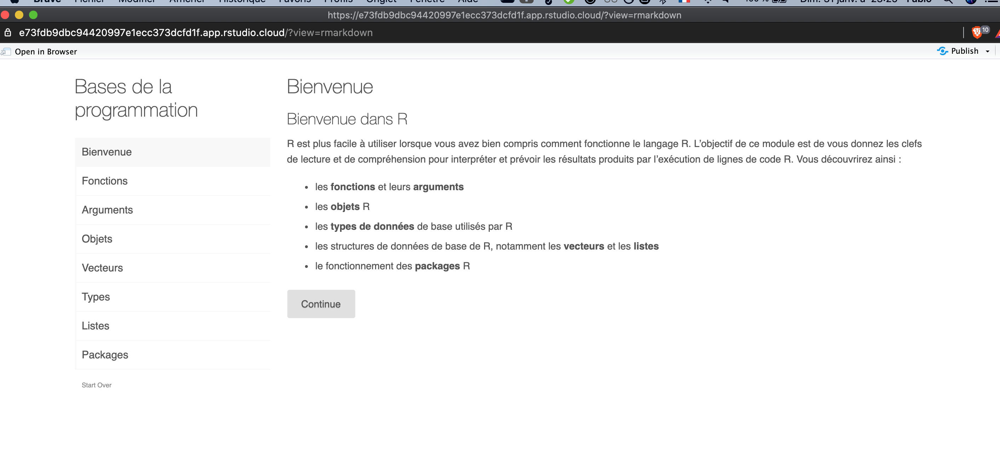
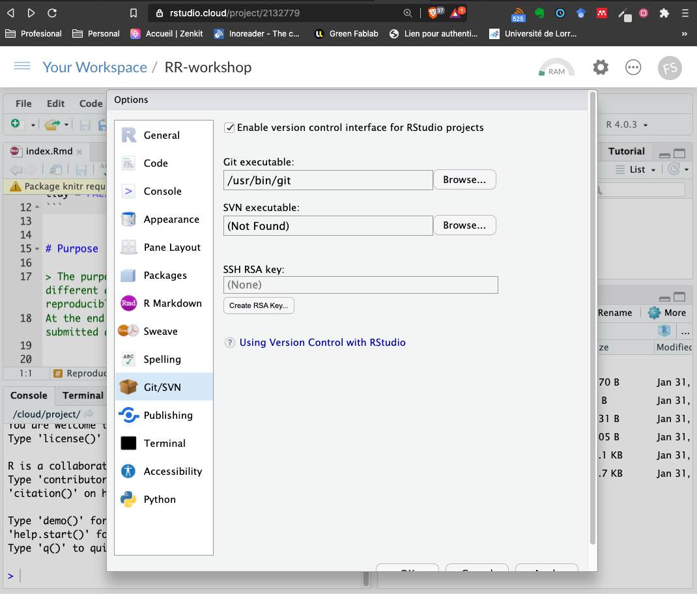

```{r , echo=FALSE, include=FALSE}
knitr::opts_chunk$set(echo = FALSE, include = FALSE)

require(fontawesome)
require(xaringanExtra)
xaringanExtra::use_share_again()
require(countdown)
```


# Learning outcomes

At the end of this

- You will have a first encounter with R & Rstudio software and its importance for open science
- You will have a basic understanding of the main functions.

---

# Agenda of this sprint


### 1. Understanding the Rstudio 

### 2. Data Visualization: an Intro


---

# What is R project? 

R is a programming language and free software environment for statistical computing and graphics.

.left-column[
- R’s mission is to enable the best and most thorough exploration of data possible . 
- It change the way people analyze, visualize, and manipulate data

https://www.r-project.org/
]

.right-column[
```{r, include=TRUE, fig.align='center', out.width='80%', cache=TRUE,}

```

Useful, but the interface is a little bit scary!..
]

---

# What is RStudio   


```{r, include=TRUE, fig.align='center', out.width='70%', cache=TRUE}

```


RStudio is an integrated development environment (IDE) that provides an interface by adding many convenient features and tools.
---

# R vs RStudio

```{r, include=TRUE, fig.align='center', cache=TRUE, out.width='90%'}
knitr::include_graphics("https://moderndive.netlify.app/images/shutterstock/R_vs_RStudio_1.png")
```

---

class:  middle center 

.assignment.infobox[
.Large[Hands on the workshop!.]

The main goal is to create an Rstudio account, and to connect it with Github 
]


---

# Using Rstudio Cloud account (Recommended)

.left-column[ 
1. Sign up for free version: https://rstudio.cloud/

2. Use you github account!

3. Voila!, C'est bon

**Timming**: 5 min
]

.right-column[ 

```{r, include=TRUE, fig.align='center', cache=TRUE, out.width='90%'}
knitr::include_graphics("img/RStudio-cloud-00.jpg")
```

]


.infobox.important.pull-down[
**RStudio Cloud is a webpage**, so no installation is required. 

However, as you have notice, there is some restrictions in the quantity of project and the virtual machine assigned to you.  It's the best option to get start!]

---

# Connecting  Github repo with Rstudio

```{r, include=TRUE, fig.align='center', cache=TRUE, out.width='90%'}
knitr::include_graphics("img/Rstudio-Github-00.png")
```

---

# Connecting  Github repo with Rstudio

```{r, include=TRUE, fig.align='center', cache=TRUE, out.width='90%'}
knitr::include_graphics("img/Rstudio-Github-01.png")
```

---
```{r, include=TRUE, fig.align='center', cache=TRUE, out.width='90%'}
knitr::include_graphics("img/Rstudio-Github-01-1.png")
```

---
# Understanding Rstudio Interface

```{r, include=TRUE, fig.align='center', cache=TRUE, out.width='60%'}

```

- 4 panels to understand

---
# Installing the packages to run the tutorials

```{r, include=TRUE, fig.align='center', cache=TRUE, out.width='70%'}

```


---

class: middle

# Hands on the PC!

- Open `Tutorials >01-basics > 01-Programming > 01-Programming-Basics-fr.Rmd`
- Run the document

.infobox.assignment[ **Objective**

- This tutorial will learn you the basic skills to understand R language (and `console` panel).

You will go step-by-step in each analysis: how to understand the basics of R language, as well as how to **run code** with the basic functions.

]

---

```{r, include=TRUE, fig.align='center', cache=TRUE, out.width='80%'}

```

```{r, include=TRUE}
countdown(minutes = 25, seconds = 0,right = 0)
```


---

# Adding the key to connect

-`Tools > Global Options > `
```{r, include=TRUE, fig.align='center', cache=TRUE, out.width='50%'}

```

- Commit your changes on Github!


---

class: middle center

you finish?.. good!

## Take 10 min for a lunch  `r fa("apple-alt")` 

### Let's move to the other Sprint!
