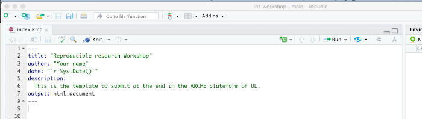
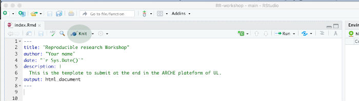

```{r , echo=FALSE, include=FALSE}
knitr::opts_chunk$set(echo = FALSE, include = FALSE)

require(fontawesome)
require(xaringanExtra)
xaringanExtra::use_share_again()

require(countdown)
```

# We are assuming that...

You know how it works:

- Github
- RStudio

So let's start...


---

# Learning outcomes

The rmarkdown package is a single package, but "R Markdown" is the backbone for an ecosystem of packages for creating computational documents in R. 


- You will produce your first reproducible document and put it online. 
- You will have a basic understanding of the main component and functions of Rmarkdown.


---

class: middle

# Agenda of this sprint


.Large[1) Understanding the Rmarkdown]

.Large[2) Connecting with github to publish your work!]


---
background-image: url(https://bookdown.org/yihui/rmarkdown/images/hex-rmarkdown.png)
background-position: 95% 50%
background-size: 35%


class: left

# What is Rmarkdown?

1. ["An authoring framework for data science."](https://rmarkdown.rstudio.com/lesson-1.html) (`r emo::ji("heavy_check_mark")`)

1. [A document format (`.Rmd`).](https://bookdown.org/yihui/rmarkdown/) (`r emo::ji("heavy_check_mark")`)

1. [An R package named `rmarkdown`.](https://rmarkdown.rstudio.com/docs/) (`r emo::ji("heavy_check_mark")`)

1. ["A file format for making dynamic documents with R."](https://rmarkdown.rstudio.com/articles_intro.html) (`r emo::ji("heavy_check_mark")`)

1. ["A tool for integrating text, code, and results."](https://r4ds.had.co.nz/communicate-intro.html) (`r emo::ji("heavy_check_mark")`)

1. ["A computational document."](http://radar.oreilly.com/2011/07/wolframs-computational-documen.html) (`r emo::ji("heavy_check_mark")`)

1. Wizardry. (`r emo::ji("wizard")`)


---
class: center
background-image: url('img/rmd_flowchart.png')
background-size: contain
background-color: #f6f6f6

##  Flow of the R Markdown? `r emo::ji("dancing")`

---
background-image: url(img/screenshots/Single-rmd.png)
background-position: 50% 5px
background-size: 70%
class: middle, bottom


**here**, you can see a typical single R Markdown file. <br>
This one is for a lab for visualizing data from the Museum of Modern Art.<br>
Let's quickly walk through some of the key parts of this file.

---

background-image: url(img/screenshots/Single-rmd0.png)
background-position: 50% 5px
background-size: 70%
class: middle, bottom


It starts with **metadata**, written in `YAML`, which is a list of keys on the left and their values on the right.


---
background-image: url(img/screenshots/Single-rmd1.png)
background-position: 50% 5px
background-size: 70%
class: middle, bottom


The first key you see is the **TITLE**, which is `Lab 02: MoMA Museum Tour`.


---
background-image: url(img/screenshots/Single-rmd2.png)
background-position: 50% 5px
background-size: 70%
class: middle, bottom


The last YAML section is all about **output**. Here the output is an **`html_document`**.

---

background-image: url(img/screenshots/Single-rmd3.png)
background-position: 50% 5px
background-size: 70%
class: middle, bottom


Beneath that, we can add options to our **`html_document`** 
  - for example, a table of contents, with the key **TOC** set to **TRUE**. 

---
background-image: url(img/screenshots/Single-rmd4.png)
background-position: 50% 5px
background-size: 70%
class: middle, bottom


So that's the metadata, but the real meat in your R Markdown file 
is text written in **markdown**...


---
background-image: url(img/screenshots/Single-rmd5.png)
background-position: 50% 5px
background-size: 70%
class: middle, bottom


and your code, written in R. So these 3 things: (1) **Metadata**, (2) *Text*, and (3) **Code** make up an *R Markdown* document.

---

# Hands on the PC: Exploring outputs  `r icon::fa("clipboard-list",  pull = "right")`

.infobox.assignment[

Let's play with the **`YAML` metadata**:


1. Open the `index.Rmd` file on Rstudio.
2. In title, select the corresponding course.
3. In `author`: Put your **Name**.
]

```{r, include=TRUE, fig.align='center', cache=TRUE, out.width='80%'}

```


```{r, include=TRUE}
countdown(minutes = 1, seconds = 0,right = 0)
```


---
class: top center

```{r, include=TRUE, fig.align='center', cache=TRUE, out.width='80%'}

```

```{r, include=TRUE, fig.align='center', cache=TRUE, out.width='100px'}
knitr::include_graphics("https://www.libraries.rutgers.edu/sites/default/files/styles/resize_to_300px_width/public/events/2019/09/knitr_0.png?itok=ubV35F1I")
```


The real magic happens, when you click on the `**Knit icon**`, and see your file turned into HTML. 

---

class: middle left

# Let's create a PDF document

Go to `Console` and write 

```r
rmarkdown::render("index.Rmd", output_format = "pdf_document")
```
**or**

```r
output: pdf_document
```  


```{r, include=TRUE}
countdown(minutes = 1, seconds = 0,right = 0)
```


---

class: middle left

# Now a Word document

Go to `Console` and write 

```r
rmarkdown::render("index.Rmd", output_format = "word_document")
```

**or**

```r
output: word_document
```  


```{r, include=TRUE}
countdown(minutes = 1, seconds = 0,right = 0)
```


---

class: middle left

# Now a Presentation document

Add the `ioslides_presentation` and add the `#` symbol to the others outputs:

```
output: ioslides_presentation
```  


```{r, include=TRUE}
countdown(minutes = 1, seconds = 0,right = 0)
```

---

class: middle center

# Ta da !!! 
### Four types of documents from one source.


---
name: clouds
class: center, middle
background-image: url(img/Clouds.jpg)
background-size: cover

class: center, middle

# How do we start .emphasis[sharing]?

# Let's create a first Website

We are going to publish this on the web !


---

background-image: url(img/screenshots/Single-knit1.png)
background-position: 50% 5px
background-size: 70%
class: middle, bottom


--


Using the **`THEME:`** key in our YAML, we changed our font and colors.

--


--


---

# Improving  the `html_output`

```
output:
  html_document:
    theme: flatly       # Adding a beauty colors
    toc: true           # Table of content
    toc_float: true     # Movable TOC
    toc_depth: 2        # Two levels in the TOC
    number_sections: true   # Using numbered sections
```

```{r, include=TRUE, echo=FALSE}
countdown( minutes = 1, seconds = 30,right = 0)
```


---

class: middle center

# But **this is still local and stuck on my computer/ Rstudio Cloud**.


---

# Commit your files on github

1. In `console`,  write `file.create(".nojekyll")`

1. In the `Environment Panel`,  go to `Git` tab.

2. Select each element that appears to be changed.
  - You can use `Ctrl / Cmd + A` to select of of them, and press `Enter`

3. Add a `Commit message`

3. Click on `Commit` 

4. Click on `Push`


```{r, include=TRUE, echo=FALSE}
countdown( minutes = 1, seconds = 30,right = 0)
```


---


class: center, middle

## Start with GitHub Pages `r emo::ji("rocket")`

---
class: middle, center

.pull-left[
## Repo

`https://github.com/lf2l/ensgsi-research-methods`

]

.pull-right[
## Link

`https://lf2l.github.io/ensgsi-research-methods`

]

---
class: middle, center

.pull-left[
## Repo

`https://github.com/<user>/<repo>`

]

.pull-right[
## Link

`https://<user>.github.io/<repo>`

]

---
background-image: url(img/index.jpg)
background-size: contain
background-size: 50%
background-color: #ffffff

---

class: middle, center

.left-column[
## Index file link


## Other file link

]

.right-column[

<br>
`https://<user>.github.io/<repo>`
<br><br><br>
`https://github.com/<user>/<repo>/<.html>`

]


---


#  On Github

1. Go to `Settings > GitHub Pages > Source` 

2. Change `None` to `Main`

3. Voila, you have your first Website `r emo::ji("smile")`


---

# More resources on Rmarkdown

- [Rmarkdown from Rstudio](https://rmarkdown.rstudio.com/lesson-1.html)
