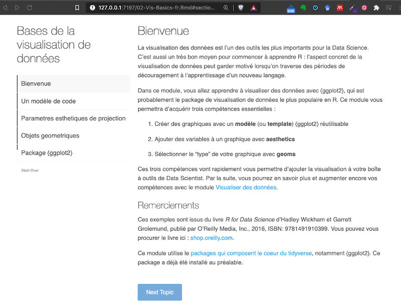

```{r , echo=FALSE, include=FALSE}
knitr::opts_chunk$set(echo = FALSE, include = FALSE)

require(fontawesome)
require(xaringanExtra)
xaringanExtra::use_share_again()

require(countdown)
```

# We are assuming that...

You know how it works:

- Github
- RStudio
- and you start to understand R & Rmarkdown approach

So let's start...


---

# Learning outcomes

Data visualization is a fundamental part of the analysis of data.

- You will produce your first reproducible image and put it online. 
- You will have a basic understanding of the main component and functions of `ggplot2`.


---

class: middle

# Agenda of this sprint


.Large[1) Understanding the `ggplot2` package]

.Large[2) Embed text and images in the `.Rmd` document and  publishin to Github ]

---

class: middle

#  What is Data Visualization?

- are graphical representations of data

--

- use different colors, shapes, and the coordinate system to summarize data

--

- tell a story

--

- are useful for exploring data


---

class: middle

## For example

[Coronavirus Pandemic (COVID-19)](https://ourworldindata.org/coronavirus)

[How LGBTQ+ hate crime is committed by young people against young people](https://www.bbc.com/news/uk-46543874)

[Why Time Flies](https://maximiliankiener.com/digitalprojects/time/)

[Mandatory Paid Vacation](https://www.instagram.com/p/CE1kpM5FhWR/?utm_source=ig_web_copy_link)

[Why are K-pop groups so big?](https://pudding.cool/2020/10/kpop/)


---

# Hands on the PC: Hi  grammar of graphics!    `r icon::fa("clipboard-list",  pull = "right")`


.infobox.assignment[


Let's play with the **`ggplot2`**:


1. Open the `Tutorials > 01-basics > 02-Dataviz > 02-Vis-Basics-fr.Rmd` file on Rstudio cloud.
2. `Run document` and make the step-by-step tutorial
3. Answer the questions, in the  `index.Rmd` document as long as you find the answers.
]
---

```{r, include=TRUE, fig.align='center', cache=TRUE, out.width='80%'}

```


```{r, include=TRUE}
countdown(minutes = 20, seconds = 0,right = 0)
```


---
class: middle


# Summarizing the insigths on `ggplot2` the ARCHE docuoment
 


---

# Commit your files changes on Github


1. In the `Environment Panel`,  go to `Git` tab.

2. Select each element that appears to be changed.
  - You can use `Ctrl / Cmd + A` to select of of them, and press `Enter`

3. Add a `Commit message`

3. Click on `Commit` 

4. Click on `Push`


```{r, include=TRUE, echo=FALSE}
countdown( minutes = 1, seconds = 30,right = 0)
```


---


class: center, middle

## Coffe  `r emo::ji("coffee")`

