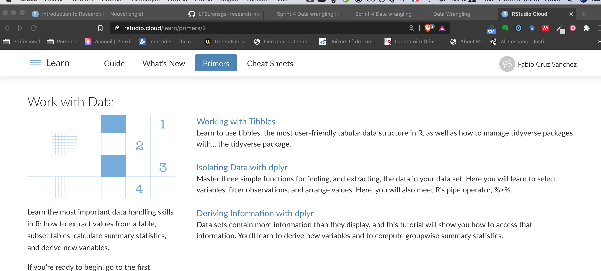

```{r , echo=FALSE, include=FALSE}
knitr::opts_chunk$set(echo = FALSE, include = FALSE)

require(fontawesome)
require(xaringanExtra)
xaringanExtra::use_share_again()

require(countdown)
```


---

class: middle

# Agenda of this sprint


1. Explore the **`tidyverse` package**


---


# Learning outcomes

Data wrangling is a major component in data anlaysis

- You will know the Major Verbs used to manipulate your data 
- You will have a basic understanding of the importance of `tidy`data.


---
background-image: url('img/01-Introduction.001.jpeg')
background-position: 95% 50%
background-size: cover

--
background-image: url('img/01-Introduction.002.jpeg')

--
background-image: url('img/01-Introduction.003.jpeg')

--
background-image: url('img/01-Introduction.004.jpeg')

--
background-image: url('img/01-Introduction.005.jpeg')

--
background-image: url('img/01-Introduction.006.jpeg')

--
background-image: url('img/01-Introduction.007.jpeg')

---

The `tidyverse` is a collection of R packages that share common philosophies and are designed to work together. <br><br> 
  
<a href="http://tidyverse.tidyverse.org/logo.png"></a>


---
class: inverse middle

.white[


## Autonomus tutorial:  Hi tidyverse!    `r icon::fa("clipboard-list",  pull = "right")`

]


---


Do the Three tutorials on [Work with data](https://rstudio.cloud/learn/primers/2)

.infobox.assignment[

1. Start with the [Working with Tibbles](https://rstudio.cloud/learn/primers/2.1).

1. Then [Isolating data with DPLYR](https://rstudio.cloud/learn/primers/2.2)

1. And finally [Derive Information with dplyr](https://rstudio.cloud/learn/primers/2.3).
]

Answer the questions, in the  `ARCHE.Rmd` document as long as you find the answers.


---

```{r, include=TRUE, fig.align='center', cache=TRUE, out.width='80%'}

```


```{r, include=TRUE}
countdown(minutes = 60, seconds = 0,right = 0)
```


---

class: center, middle

Take a break 15 min.

## Coffe  `r emo::ji("coffee")`

