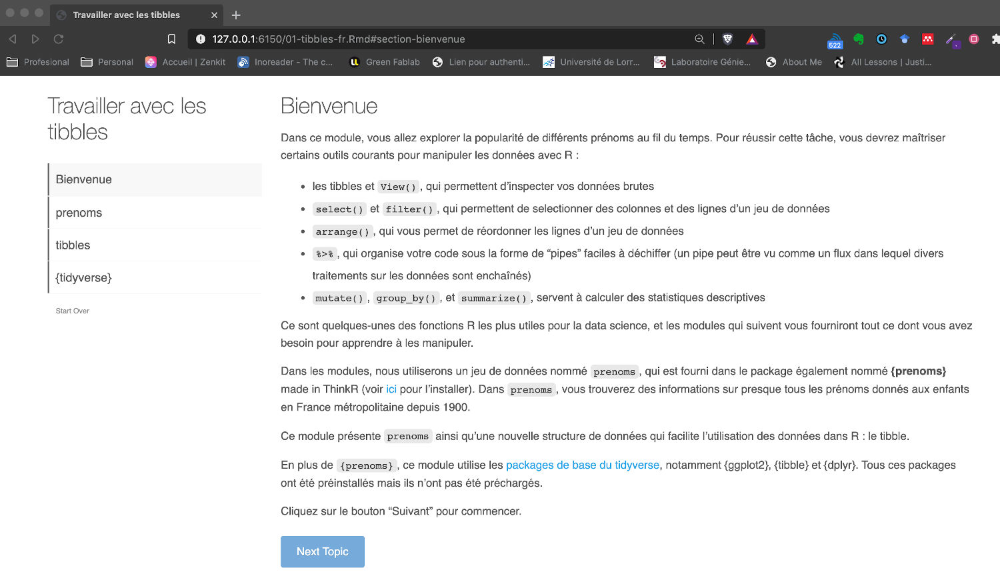

```{r , echo=FALSE, include=FALSE}
knitr::opts_chunk$set(echo = FALSE, include = FALSE)

require(fontawesome)
require(xaringanExtra)
xaringanExtra::use_share_again()

require(countdown)
```

# We are assuming that...

You know how it works:

- Github
- RStudio
- and you start to understand R & Rmarkdown approach
- You know some basics of `ggplot` package

So let's start...


---

class: middle

# Agenda of this sprint


1. Explore the **`tidyverse` package**


---


# Learning outcomes

Data wrangling is a major component in data anlaysis

- You will know the Five Major Versb used to manipulate your data 
- You will have a basic understanding of the importante of `tidy`data.


---
background-image: url('img/01-Introduction.001.jpeg')
background-position: 95% 50%
background-size: cover

--
background-image: url('img/01-Introduction.002.jpeg')

--
background-image: url('img/01-Introduction.003.jpeg')

--
background-image: url('img/01-Introduction.004.jpeg')

--
background-image: url('img/01-Introduction.005.jpeg')

--
background-image: url('img/01-Introduction.006.jpeg')

--
background-image: url('img/01-Introduction.007.jpeg')

---

# Hands on the PC: Hi  tydiverse!    `r icon::fa("clipboard-list",  pull = "right")`


.infobox.assignment[

Let's play with the **`tidyverse`**:


1. Open the `Tutorials > 02-transform-data > 01-tibbles > 01-tibbles-fr.Rmd` file on Rstudio cloud.

1. Install the package `prenoms` using `devtools::install_github( "ThinkR-open/prenoms")` in the console panel.
2. `Run document` and make the step-by-step tutorial
3. Answer the questions, in the  `index.Rmd` document as long as you find the answers.
]
---

```{r, include=TRUE, fig.align='center', cache=TRUE, out.width='80%'}

```


```{r, include=TRUE}
countdown(minutes = 20, seconds = 0,right = 0)
```


---
class: middle center


# Summarizing the insigths on `tidyver` 


---

# Commit your files changes on Github

1. In the `Environment Panel`,  go to `Git` tab.

2. Select each element that appears to be changed.
  - You can use `Ctrl / Cmd + A` to select of of them, and press `Enter`

3. Add a `Commit message`

3. Click on `Commit` 

4. Click on `Push`


```{r, include=TRUE, echo=FALSE}
countdown( minutes = 1, seconds = 30,right = 0)
```


---

class: center, middle

## Coffe  `r emo::ji("coffee")`

